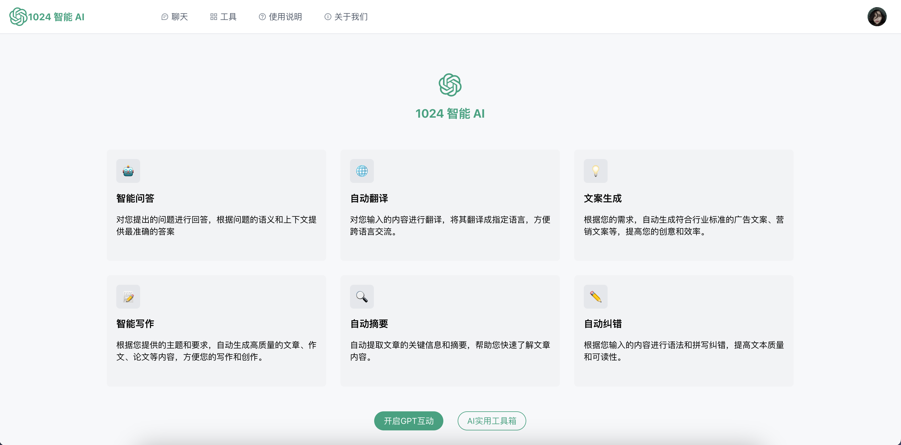
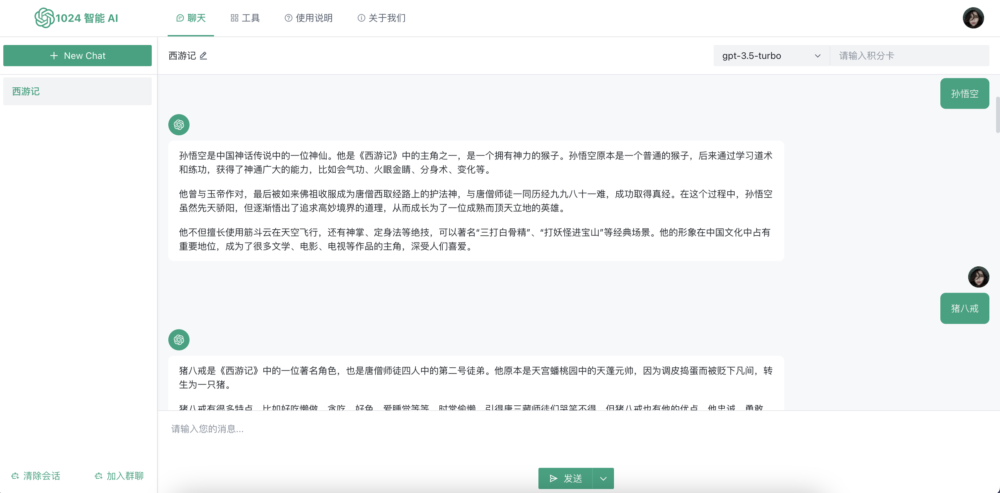
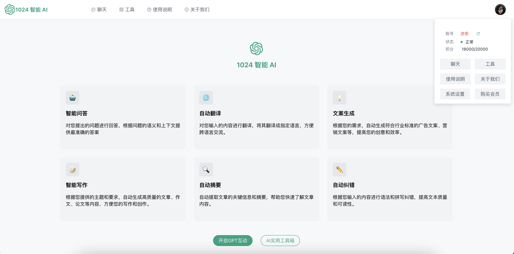

# ChatGPT-Client-Next

`ChatGPT-Client-Next` 是一个基于 `GPT-3/4` 的聊天机器人客户端，使用 `Vue`, `Arco Design`, `TypeScript` 进行开发，旨在提供一个简单易用的聊天机器人客户端，帮助用户更好地使用 `GPT-3/4` 进行聊天。

## Online Demo

[https://zhuzhaofeng.site/ChatGPT-Client-Next/](https://zhuzhaofeng.site/ChatGPT-Client-Next/)

## 示例







## 安装

在使用 `ChatGPT-Client-Next` 之前，需要先安装以下软件：

- `Node.js`
- `npm`

安装完成之后，可以使用以下命令在本地运行 `ChatGPT-Client-Next`：

```bash
# 克隆项目 https
git clone https://github.com/zhuzhaofeng/ChatGPT-Client-Next.git
# 克隆项目 ssh
git clone git@github.com:zhuzhaofeng/ChatGPT-Client-Next.git
# 克隆项目 Github CLI
git clone gh repo clone zhuzhaofeng/ChatGPT-Client-Next

# 进入项目目录
cd ChatGPT-Client-Next

# 安装依赖
npm install

# 运行项目
npm start
```

## 使用

在运行 `ChatGPT-Client-Next` 之后，可以在浏览器中访问 `http://localhost:3000/`，进入聊天机器人客户端。

聊天记录会自动保存在本地，可以在聊天记录页面查看。

## 贡献

如果您在使用 `ChatGPT-Client-Next` 的过程中发现了问题，或者有任何建议或想法，欢迎在 `GitHub` 上提交`issue` 或者`pull request`。
